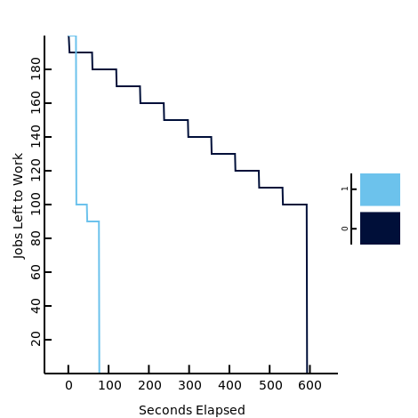

# Coworker #

Coworker is a delayed work runner built for JVM Based languages, written in
kotlin. Coworker started off as an experiment as bringin coroutine ideas
to background work. Allowing you to work on something else if you're say
waiting for an external system.

Specifically Coworker introduces three new concepts:
  * yield - Allowing a piece of work to yield to higher priority work,
    or yield for a set time.
  * Stages - Allowing a piece of work to be more naturally expressed
    with the previously mentioned yielding concepts.
  * `LISTEN`/`NOTIFY` - Using native SQL notifications to allow picking up work
     without constantly querying the DB for new work.

From there Coworker than adopted ideas specifically from [InstJobs][instructure_jobs]
which is a ruby based delayed work runner that has several nice features.
Specifically it brings over the ideas of:

* Self Healing: Coworker if configured will rescheduled work whose underlying
  node died.
* Failed Work Table: Allowing you to track which Work failed.
* N-Strands: Allowing only a certain number of stranded work to run at a time.
* Marginalia: Log where in code a query is happening within the framework.

## Supported Architectures ##

_Tl;dr: PostgreSQL for DBs, Consul for Service Checks, Java/Kotlin officially suported._

Currently Coworker only has support for PostgreSQL DBs. The biggest reason for
this is due to: `LISTEN`/`NOTIFY`. However since postgres has these features
other postgresql only queries have been written that make the workmanager code more
efficient.

As for checking if work are still running, currently the method of doing this
is built into [Consul][consul] service checks. Although there is nothing unique
to consul being used here per say, other architectures are not supported due to
familiarity. If you'd like to see something like zookeeper support please file a PR!

## Setup ##

Setting up coworker is similar to other Java dependencies. The only thing to be warry
of is Migrations. Coworker leaves the job of creating the SQL tables up to the user so
they can use whichever sort of framework/deployment method they want for migrations.

You can find all migrations in our `src/main/resources/migrations/` folder. The naming
of migrations is as follows: `MigrationVersion_MigrationName_DatabaseType`. So you
should be able to identify which migrations should be applied in which order, and
what database they're for.

Currently Coworker distributes itself through the JITPACK repos for maven/gradle.
Although we plan to one day be on maven-central. Until then simply add the JITPACK
repo:

```xml
<repositories>
    <repository>
        <id>jitpack.io</id>
        <url>https://jitpack.io</url>
    </repository>
</repositories>
```

And then add the dependency to coworker:

```xml
<dependency>
    <groupId>com.github.SecurityInsanity</groupId>
    <artifactId>Coworker</artifactId>
    <version>1.0.0</version>
</dependency>
```

## Writing Jobs ##

There are some basic example jobs in: `bench/coworker/`. Specifically we have
three job types:

  * EmptyJob - Just exits the job right away. Minimal piece of code.
  * EchoJob - Echos to the console, and then exits.
  * RemoteJob - Makes an https call to google, waits a minute, and then finishes.

## Benchmarks ##

_NOTE: Bencmarks were done on the following scenarios:_

"Job Box": t3.large instance in AWS in us-east-1 deployed in a VPC.

Java: openjdk-8-jdk-headless

Linux: ubuntu 16.04

Maven: 3.3.9

Jesque:
  * Redis: Using a cache.m3.xlarge with no replicas, not encrypting at rest or in transit.
    Deployed in the same VPC, same region, with no other applications connecting.

Coworker:
  * PostgreSQL: Using a db.m4.xlarge with no replicas (production mode), Deployed
    in the same VPC, same region, with no other applications connecting.

Jobs:
  100 jobs that just echo "Hello World", to simulate quick running jobs.
  100 jobs that call `google.com`, and wait a minute to simulate waiting on a remote job.

### Results ###

_NOTE: The Graph was generated using the [plotd][plotd] tool_



In this graph "1" is really the Coworker Executor, and "2" is Jesque. As you
can see, Coworker finishes it's work pool in about 13% of the time as Jesque!

### But How Real to Life is this? ###

Coworker performs so much faster than Jesque for one simple reason. Yielding.
Since Coworker is able to yield it can "kick-off" all those remote jobs, and
continue other pieces of work while it waits for those jobs to be ready again.
Meanwhile Jesque has no concept of yield. So it gets all 10 workers _stuck_
waiting for the remote job to finish after a minute.

If it's just a speed of queueing jobs that do nothing jesque will always be faster
because Redis is _so much_ faster than postgres. That being said these sorts of tests
are completely not true to life since your worker will actually be doing work.

Obviously a performance test will never be able to fully tell you how your
application will run, since every application is different. However generally
the two biggest benefits you get from using Coworker will be:

  * Limiting the number of work that can stomp your DB (e.g. large analytics queries)
    by using nstrands.
  * Work that do a lot of waiting. (E.g. waiting for a provision in another system to
    complete).

If this two cases do not fit you Coworker may still be faster than your delayed work
runner currently. That is if you're using SQL as the backing store, or an unoptimized
redis store.

[instructure_jobs]: https://github.com/instructure/inst-jobs
[consul]: https://www.consul.io/
[plotd]: https://github.com/BlackEdder/plotd
